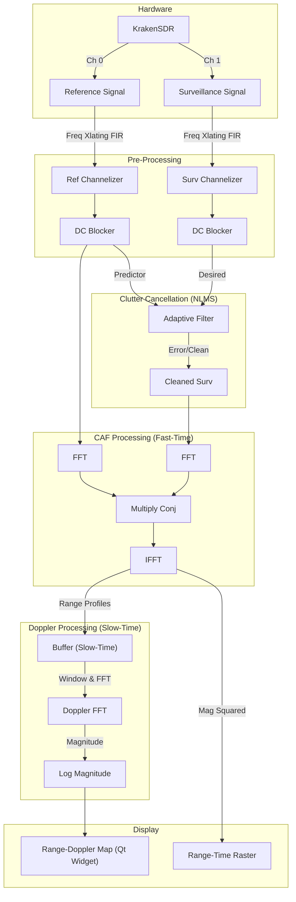

---

## Requirements

### Hardware
- **KrakenSDR (5-channel coherent SDR)**
- **Reference antenna**: directed toward a strong local FM or TV transmitter  
- **Surveillance antennas (4)**: spaced and oriented toward the monitored airspace  
- **Stable clock and calibrated cables** (phase coherence required)

### Software Dependencies
- [GNU Radio 3.10+](https://wiki.gnuradio.org/)
- [gr-osmosdr](https://osmocom.org/projects/gr-osmosdr/wiki) (with SoapySDR support)
- `numpy`, `PyQt5`, `sip`
- `g++` (for C++ acceleration)
- Optional: `SoapySDR` driver for KrakenRF

Install dependencies (Ubuntu/Debian):
```bash
sudo apt install gnuradio gr-osmosdr python3-pyqt5 python3-sip build-essential
pip install numpy
```

## Signal Flow Diagram

The following diagram illustrates the processing chain for the Passive Radar, showing the Reference and Surveillance paths, Cross-Ambiguity Function (CAF) processing, and Range-Doppler display.



## Performance Acceleration (C++)

This project includes C++ implementations for computationally intensive blocks to improve real-time performance.

1.  **NLMS Clutter Canceller**: `src/nlms_clutter_canceller.cpp`
2.  **Doppler Processing**: `src/doppler_processing.cpp`

The Python top block (`kraken_passive_radar_top_block.py`) automatically detects if these sources are present and attempts to compile them into shared libraries (`.so`) using `g++`. If compilation succeeds, the optimized C++ logic is loaded via `ctypes`. If `g++` is missing or compilation fails, the system seamlessly falls back to the pure Python/NumPy implementation.

**Note on Doppler Processing:** The C++ optimization for Doppler processing currently supports power-of-two Doppler lengths (e.g., 64, 128, 256). If a non-power-of-two length is selected, the system will use the Python fallback.
